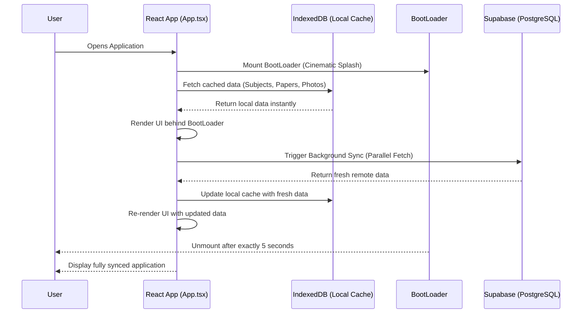
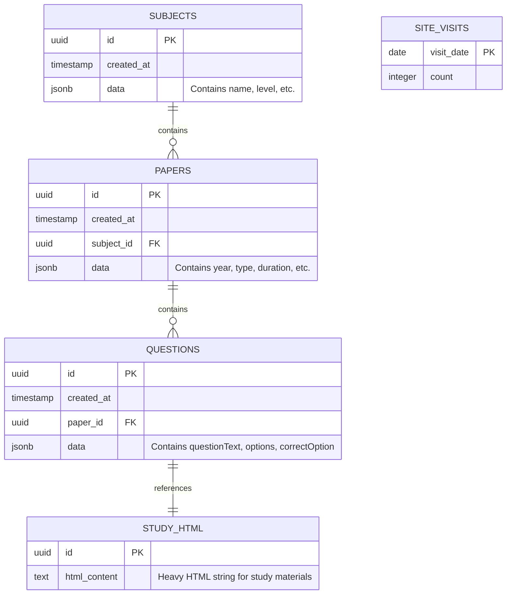

# Mehewara Site - Documentation for Developers

This document provides a comprehensive overview of the Mehewara educational platform codebase. It is designed to help future developers understand the architecture, technology stack, directory structure, and established patterns within the project.

## 1. Project Overview
Mehewara is a modern, highly interactive single-page application (SPA) designed to help students in Sri Lanka practice and review past papers for O/L and A/L examinations. The platform includes a complex administrative CMS for content management and a highly polished, cinematic frontend for students. 

## 2. Technical Specifications

### Core Technologies
| Category | Technology | Version | Description |
| :--- | :--- | :--- | :--- |
| **Framework** | React | 19.0.1 | UI library for building the SPA. |
| **Build Tool** | Vite | 6.4.3 | Fast build tool and development server. |
| **Language** | TypeScript | 5.8.2 | Strongly typed programming language. |
| **Styling** | Tailwind CSS | 4.1.14 | Utility-first CSS framework for rapid UI development. |
| **Database** | Supabase JS | 2.107.0 | PostgreSQL database, Authentication, and Storage client. |
| **Caching** | idb-keyval | 6.2.5 | Promise-based wrapper for IndexedDB local storage. |
| **Rich Text** | Tiptap | 3.26.0 | Headless rich text editor framework. |
| **Mathematics** | KaTeX | 0.17.0 | Fast math typesetting library for LaTeX rendering. |

### Environment Variables
The application requires the following environment variables defined in a `.env` file at the project root:
| Variable | Purpose |
| :--- | :--- |
| `VITE_SUPABASE_URL` | The endpoint URL for the Supabase instance. |
| `VITE_SUPABASE_ANON_KEY` | The anonymous public key for Supabase client initialization. |

## 3. Architecture and Data Flow

The application operates on a **Cache-First, Sync-Later** pattern to ensure instantaneous load times. 

### Data Flow Sequence

## 4. Directory Structure

| Directory/File | Purpose |
| :--- | :--- |
| `src/main.tsx` | Application entry point. Mounts the React root and Context providers. |
| `src/App.tsx` | Core orchestrator. Handles boot sequence, global state, and background sync. |
| `src/supabase.ts` | Contains all database interaction logic, abstracting the Supabase client. |
| `src/types.ts` | Centralized TypeScript interfaces (`Subject`, `Paper`, `Question`, etc.). |
| `src/components/` | Core UI components (`BootLoader`, `PracticeSession`, `RichTextEditor`). |
| `src/components/admin/`| CMS interfaces (`SubjectsTab`, `PapersTab`, `EditQuestionsTab`). |
| `src/utils/` | Helper functions (`storage.ts`, `parseTxt.ts`, `htmlThemer.ts`). |
| `*.sql` files | Database migration files containing table schemas and RLS policies. |

## 5. Database Schema (Supabase PostgreSQL)

The database strictly utilizes PostgreSQL but leverages a document-store pattern. Most entity properties are stored within a JSONB column named `data`.

### Entity Relationship Diagram

*Note: Heavy HTML content (like `studyMaterialHtml`) is stripped from the main JSON object and stored in the `study_html` table. This drastically reduces payload sizes when querying lists of questions or papers.*

## 6. Developer Guidelines

When contributing to this codebase, developers must adhere to the following strict architectural principles:

1. **Non-Blocking UI:** Never block the user interface waiting for network requests on initial load. Always load from IndexedDB first, and silently synchronize with Supabase in the background.
2. **Parallel Batch Fetching:** Supabase `.select()` queries on large JSONB columns can timeout due to PostgREST limitations. When loading thousands of rows (e.g., loading all questions for synchronization), utilize the `Promise.all` batching pattern strictly implemented in `supabase.ts` (`dbLoadQuestions`).
3. **Glassmorphism Aesthetic:** The frontend relies on a specific aesthetic using CSS backdrop-blurs, absolute positioning, and dynamic opacities. New components must align with the predefined Tailwind utility classes found in `index.css`.
4. **Boot Sequence Integrity:** The cinematic bootloader (`BootLoader.tsx`) relies on strictly calibrated timeouts. Do not alter these timings without ensuring the background synchronization lifecycle is not negatively impacted.

## 7. Local Development Setup

### Prerequisites
- Node.js (v18 or higher recommended)
- Git

### Installation Steps
1. **Clone the repository:** Ensure you are in the project root.
2. **Install dependencies:** Run `npm install` to download all necessary packages.
3. **Environment Setup:** Copy `.env.example` to `.env` and populate it with the provided Supabase keys.
4. **Start Development Server:** Run `npm run dev`. The application will be accessible at `http://localhost:3000`.
5. **Production Build:** Run `npm run build` to generate the optimized, minified production assets in the `dist` directory.
